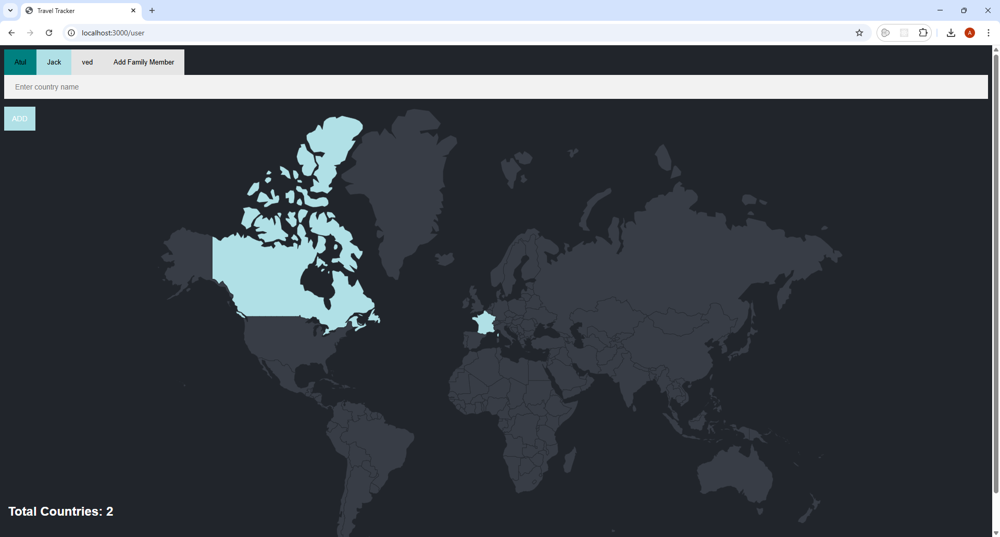
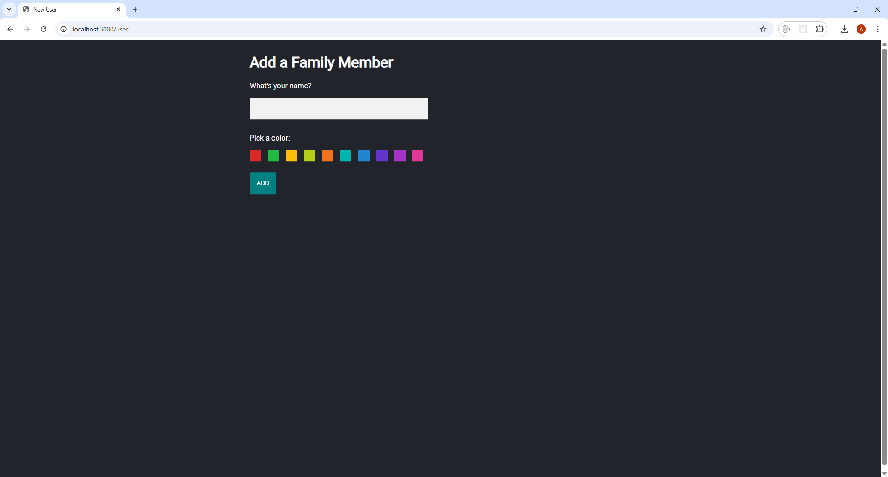

# 🌍 World Travel Tracker

A full-stack web application built with **Node.js**, **Express**, **PostgreSQL**, and **EJS** to track and visualize the countries visited by different family members. Each user is represented with a distinct color, and data is stored in a relational database.

---

## 🚀 Features

- Add and switch between multiple users (family members)
- Track visited countries per user
- Prevents duplicate country entries
- Custom color representation per user
- Server-side rendering with EJS templates
- Secure SQL operations using parameterized queries

---

## 🛠️ Tech Stack

- **Backend:** Node.js, Express.js
- **Frontend:** HTML, EJS
- **Database:** PostgreSQL
- **Other:** body-parser, pg (PostgreSQL client)

---

## 📁 Project Structure

```
.
├── public/                 # Static assets (CSS/images if any)
├── views/                 # EJS templates
│   ├── index.ejs
│   └── new.ejs
├── index.js               # Main server code
├── countries.csv          # CSV data for countries table
└── README.md              # Project documentation
```

---

## 🔧 Setup Instructions

### 1. Clone the Repository

```bash
git clone https://github.com/agamswami/World_Travel_Tracker.git
cd world-travel-tracker
```

### 2. Install Dependencies

```bash
npm install
```

### 3. Create PostgreSQL Database

Make sure PostgreSQL is installed and running on your machine. Then run:

```sql
CREATE DATABASE travel;
```

### 4. Create Tables and Seed Initial Data

Connect to the `travel` database and run the following SQL statements:

```sql
DROP TABLE IF EXISTS countries, visited_countries, family_members;

CREATE TABLE countries (
  id SERIAL PRIMARY KEY,
  country_code CHAR(2),
  country_name VARCHAR(100)
);

CREATE TABLE family_members(
  id SERIAL PRIMARY KEY,
  name VARCHAR(15) UNIQUE NOT NULL,
  color VARCHAR(15)
);

CREATE TABLE visited_countries(
  id SERIAL PRIMARY KEY,
  country_code CHAR(2) NOT NULL,
  user_id INTEGER REFERENCES family_members(id)
);

INSERT INTO family_members (name, color)
VALUES ('Atul', 'teal'), ('Jack', 'powderblue');

INSERT INTO visited_countries (country_code, user_id)
VALUES ('FR', 1), ('GB', 1), ('CA', 2), ('FR', 2);
```

### 5. Import Countries from CSV

Ensure your `countries.csv` file is formatted like:

```csv
id,country_code,country_name
1,AF,Afghanistan
2,AX,Aland Islands
3,AL,Albania
...
```

You can import this data into PostgreSQL like so (adjust the path accordingly):

```sql
COPY countries(country_code, country_name)
FROM '/absolute/path/to/countries.csv'
DELIMITER ','
CSV HEADER;
```

📌 *Note: Use a full absolute path and ensure PostgreSQL has permission to access the file.*

---

## 🧑‍💻 Running the Application

Start the Express server:

```bash
node index.js
```

Open your browser and visit: [http://localhost:3000](http://localhost:3000)

---

## 📸 Screenshots

| Homepage                   | Add New User                |
|----------------------------|-----------------------------|
|  |  |

---

## 🧩 Future Enhancements

- Interactive map to show visited countries
- User login with secure authentication
- Improved frontend using React or TailwindCSS
- Mobile responsiveness
